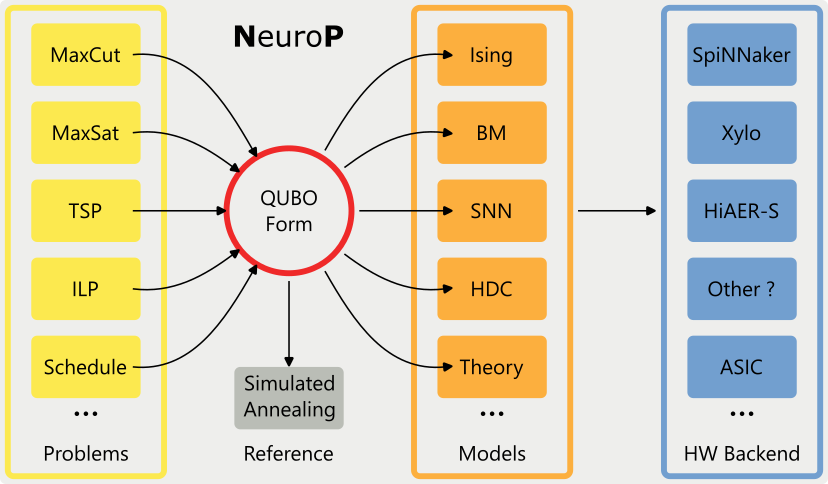

.. NeuroP documentation master file, created by
   sphinx-quickstart on Mon Jul  3 11:14:48 2023.
   You can adapt this file completely to your liking, but it should at least
   contain the root `toctree` directive.

.. title:: Welcome

**N**\ euro\ **P**
==================================
Solving :math:`\text{NP}`-hard problems on neuromorphic hardware using quadratic unconstrained binary optimization (QUBO).

.. warning::
   This project is under active development.

   The :math:`\text{Neuro}^\text{P}` library aims to automate the pipeline from NP-hard problem formulations to neuromorphic hardware and back.

.. rubric:: Modules

.. autosummary::
   :toctree: generated

   ~neurop.Problem
   ~neurop.Model
   ~neurop.Backend

Index
==================

* :ref:`genindex`
* :ref:`modindex`
* :ref:`search`
