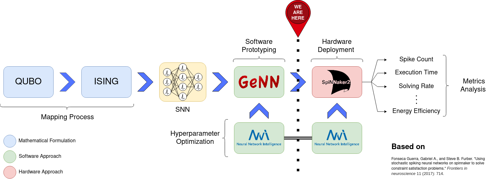
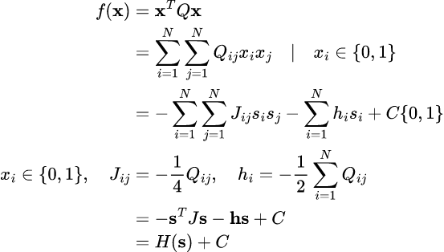
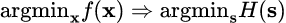

# <b>isingToSNN</b>
## <b>Background</b>

Within this project the mapping process of a generic ISING model described by the Hamiltonian:

$$H=-\sum_i^N \sum_j^N J_{ij} s_i s_j-\sum_i h_i s_i$$;

in the field of Spiking Neural Networks.

The picture below schematically summarizes the different steps:<br>



The pipeline foreseen for the implementation consists of a series of steps, first of all the process of mapping the objective function $f(\textbf{x})$ into the Hamiltonian of ISING $H(\textbf{s})$:





Once obtained the map of the couplings $J$, and the external magnetic field $h$, through the mapping between the QUBO to ISING. In order to map the corresponding Hamiltonian, reference is made to the mapping process described by [Fonseca et al.]

A first network prototype is then developed through the [GeNN] platform, a GPU-enhanced neural network simulation environment based on code generation for Nvidia CUDA, which allows to perform numerous simulations in a short time. Furthermore, in order to improve the performance of the network in the search for the optimum, the tool [NNI] is used which allows to provide an optimization of the hyperparameters associated with the network.

In order to evaluate the actual capabilities of the network, a code deployment will be performed on [SpiNNaker 1] and [SpiNNaker 2], again through a hyperparameter optimization process in order to compensate for the weight quantization process.

[Fonseca et al.]: https://www.frontiersin.org/articles/10.3389/fnins.2017.00714/full
[GeNN]: https://genn-team.github.io/genn/documentation/4/html/index.html
[NNI]: https://nni.readthedocs.io/en/stable/
[SpiNNaker 1]: https://apt.cs.manchester.ac.uk/projects/SpiNNaker/
[SpiNNaker 2]: https://apt.cs.manchester.ac.uk/projects/SpiNNaker/


### Reference
The reference material used to develop the research is obtained from:

- Fonseca Guerra, Gabriel A., and Steve B. Furber. "Using stochastic spiking neural networks on spinnaker to solve constraint satisfaction problems." Frontiers in neuroscience 11 (2017): 714.
- Knight, James C., Anton Komissarov, and Thomas Nowotny. "PyGeNN: a Python library for GPU-enhanced neural networks." Frontiers in Neuroinformatics 15 (2021): 659005.


## Virtual environment configuration

The project makes use of the virtual environment creator conda.

Conda installation:
```
wget https://repo.anaconda.com/miniconda/Miniconda3-py38_4.10.3-Linux-x86_64.sh
chmod 777 Miniconda3-py38_4.10.3-Linux-x86_64.sh
./Miniconda3-py38_4.10.3-Linux-x86_64.sh
```
Virtual environment creation:
```
conda create --name cspPy38 python=3.8.15
```
Environment activation
```
conda activate cspPy38
```
Package installation, through the following commands the package `numpy` and `notebook`(Jupyter Notebook) will be installed, the version of PyGeNN that is recommended to install can be found at the [link]
```
conda install pip
pip install numpy notebook
pip install pygenn-4.8.0-cp38-cp38-linux_x86_64.whl
python -m ipykernel install --user --name=cspPy38
```

[link]: https://github.com/genn-team/genn/releases/download/4.7.1/pygenn-4.7.1-cp36-cp36m-linux_x86_64.whl:

## Project Structure
`hyperdimNearestNeighbors`: contains the script that allows you to compute the first neighbors, for a regular lattice with an arbitrary number of spins (per dimension) in n-dimensions;
`bruteForceSolver`: returns the minimum energy value and the corresponding configurations, using the brute-force method;
`isingToSNN`: main script which contains the description of the problem to be solved, the mapping in SNN and the neuron activity plot.

## Contact
- riccardo.pignari@polito.it
- gianvito.urgese@polito.it

